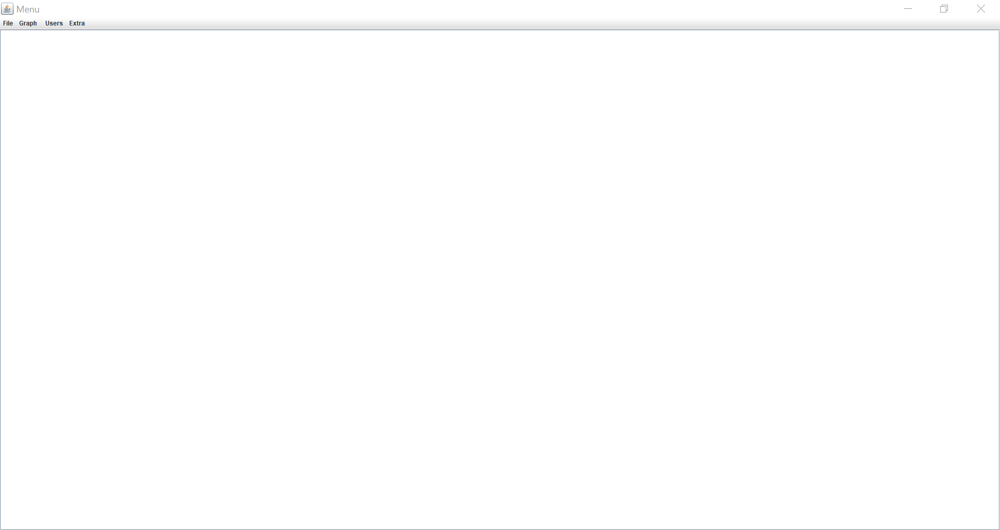
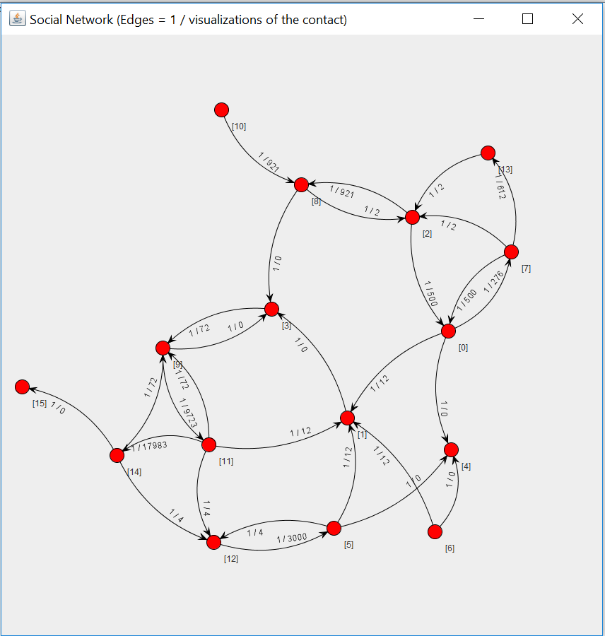
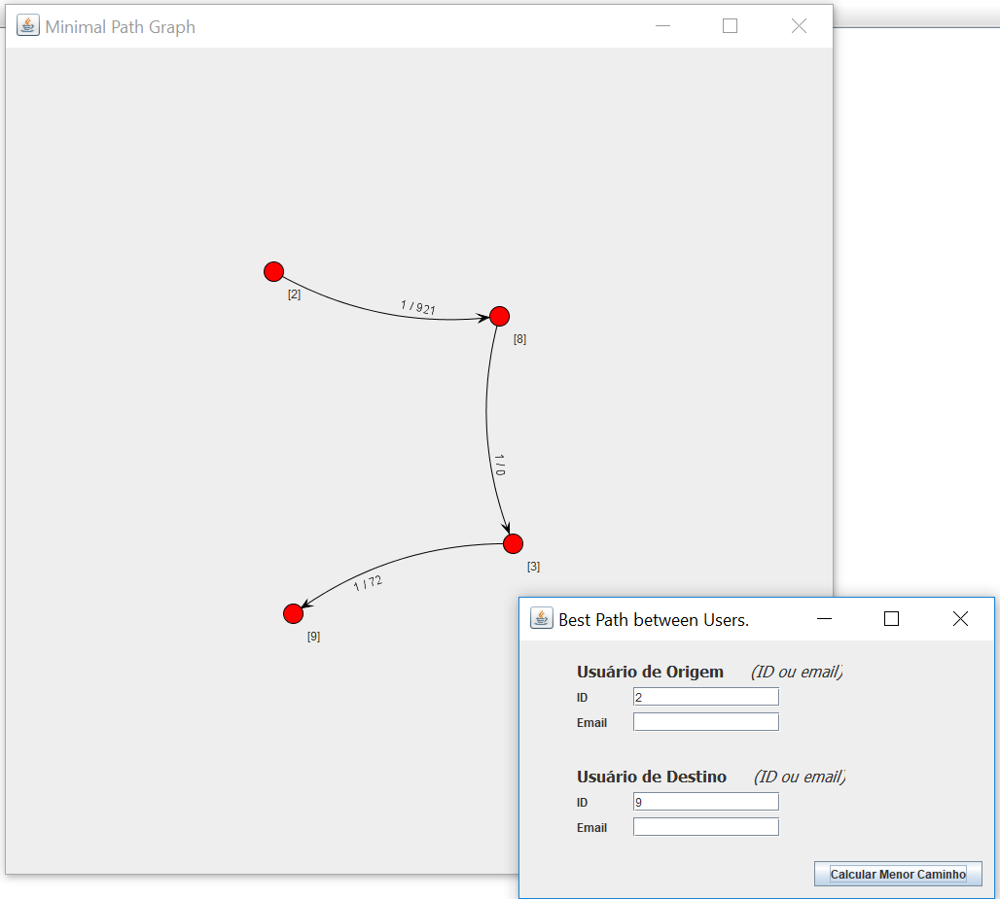
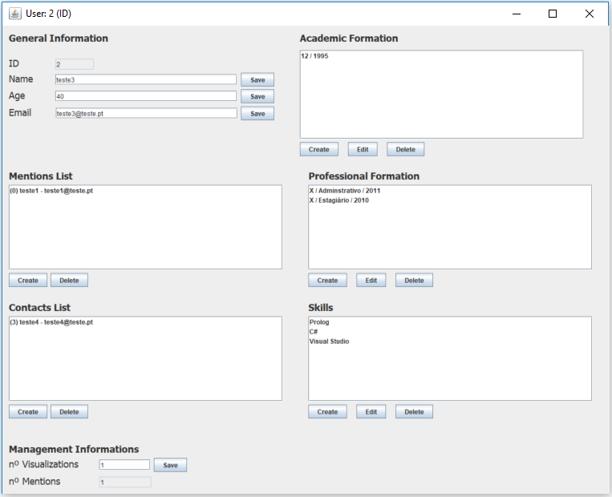
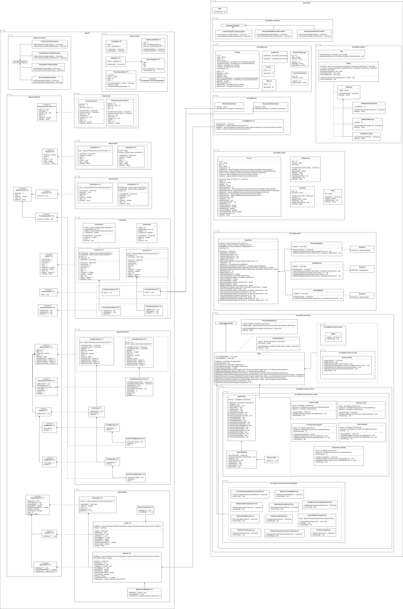

# Social Network

Project for [IPP/ESTG](https://www.estg.ipp.pt) course "Estruturas de Dados" (Data Structures)

## Main Components

### **[Library](https://github.com/ighour/ipp-ed-lib)** - Own library of abstract data types.
### **[Project](https://github.com/ighour/ipp-ed)** - Project made using the library to construct a social network. *(here)*

## Objectives

* The main purpose is to construct a social network which will receive an input with users data (json file), construct a network with them and enable it's management.

* Current repository will use abstract data structures repository and construct the project of Social Graph. It is not possible to use any of java collections API, only the ones created in my other repository.

## Additional Data Types

* **Social Network**: a modification of Network, because it was necessary to receive the brute info about adjacency matrix and vertices of network to send to Jung API.

* **PersonIdOrderedList**: a modification of OrderedArrayList to provided binary search of an user with his id.

* **PersonEmailOrderedList**: a modification of OrderedArrayList to provided binary search of an user with his email.

* **Store**: manages all data from users (graph and lists). Uses singleton pattern.

## Features

* Load a JSON File: it can receive a json file with user data to populate the network.

* View the Graph: the social network can be viewed using the Jung API.

* Complete: it is possible to check if the network is complete.

* Best Path Between Users: it is possible to view the best path between users in network.

* Reachable Users: it is possible to view all reachable users in network from another user.

* Unreachable Users: it is possible to view all unreachable users in network from another user.

* Create an User: it is possible to add a new user to network.

* User Profile: it is possible to edit and view an user.

* It is possible to view if there is users of a company with relation to another user.

* It is possible to list users with desired skill, coming from desired user and ordered by link cost.

* It is possible to list users with desired skills who work(ed) in a company and are a contact of contacts of an user.

* It is possible to view the relation between users of desired role in a company and users with same role in another company.

* It is possible to see the media of contacts and mentions of the network comparing to the partial network containing only reachable users from an user.

* It is possible to count the minimum number of links to conect an user to the others.

* It is possible to change the cost of links: 1 / visualizations, 1 / mentions or 1 (constant).

## Screenshots

* **Menu**

* **Network View**

* **Best Path Between Users**

* **User Profile**

## Built With

* [Guava](https://github.com/google/guava/wiki/Release23) - Used to show graph with Jung.
* [Gson](https://github.com/google/gson) - Java serialization/deserialization library to convert Java Objects into JSON and back.
* [Java](https://www.java.com/)
* [Jung](https://github.com/jrtom/jung) - Java Universal Network/Graph Framework, to show the graphs.
* [NetBeans](https://netbeans.org/)

## Modeling

## Installation

To test this project, you can simple download the complete project file and run the jar file. Otherwise, you have to download both repositories (project and ADT library) and dependencies and build it.

## Samples

Some samples were provided to test the project. They are in the sample folder of this repository.

* **Sample 00**: contains more then fifteen users.

* **Sample 01**: demo sample given to project development.

* **Sample 02**: all users are connected, to test if graph is complete.

* **Sample 03**: one user is not connected to anyone, to test if graph is connected.

* **Sample 04**: there is users with 0 visualizations, to test the result of infinite weight (1/0).

* **Sample 05**: the minimal path between two users is different when using 1/visualizations as weight or 1 (constant) as weight.

* **Sample 06**: test if users from a company can achieve another user.

## Reports

A full report of this project is available in portuguese version [here](sample/report.pdf).
